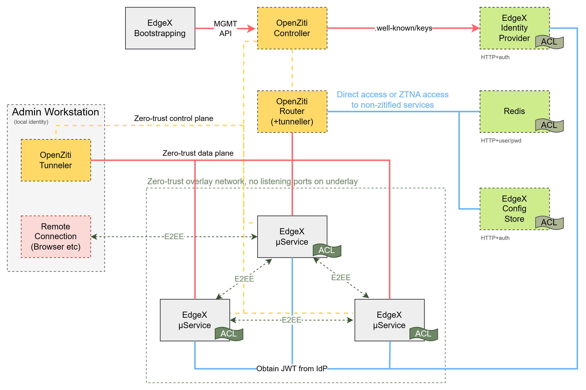

# Zero Trust

## Introduction

Zero Trust is a set of security strategies centered around the fundamental principle that no network is safe. There are
numerous vendors, all using the "zero trust" adjective to describe their security solutions. At the core of zero trust
are a few fundamental principles:

* Explicit Authorization: connections should be authenticated before traffic can be sent
* Cryptographically Verifiable Identities: connections should be authenticated using strong identities
* Least Privilege Access: identities should have access only the minimum set of services they require
* Continual Authentication: authorized connections should be able to be revoked immediately and monitored continuously

With version 3.2+, EdgeX Foundry can now secure its core services with a zero trust configuration. EdgeX Foundry has
integrated with [OpenZiti](https://openziti.io) to provide secure, zero trust connectivity among the EdgeX provided
services based on go. This includes the core services, support services, application services and numerous device
services.

OpenZiti also offers a novel approach of embedding these zero trust concepts directly into services through SDKs. By
adopting OpenZiti, EdgeX Foundry core services no longer have ports exposed to the IP-based underlay network at all. 
After enabling zero trust support, the EdgeX Foundry services will not be discoverable nor attackable by standard 
IP-based tooling whatsoever. Any attacks will first need to be authenticated into the OpenZiti overlay network and then
also authorized to make connections to the relevant EdgeX Foundry service.

## About OpenZiti

OpenZiti is an open source project focused on bringing zero trust networking principles directly into any application.
It accomplishes this by providing [numerous SDKs](https://openziti.io/docs/reference/developer/sdk/) that can be
integrated into any application. EdgeX Foundry has integrated the [golang sdk](https://github.com/openziti/sdk-golang/)
from the OpenZiti project, enabling secure connectivity through an OpenZiti overlay mesh network. OpenZiti also provides
clients for all major desktop and mobile operating systems that allow applications which are not OpenZiti-enabled to
access the overlay network called tunnelers. If an OpenZiti SDK cannot be integrated into an application that needs to 
connect to services secured via OpenZiti, such as the core EdgeX Foundry services, these clients can be used to provide
access. These applications are known as tunnelers.

An OpenZiti overlay network consists of a controller and edge routers. The controller, as it sounds, is responsible for
decisions surrounding the overlay network such as authentication, authorization, management of the overlay, etc. Edge
Routers are responsible for creating the overlay mesh network. One or more can link together to form a fully redundant
mesh and routers may be assigned specific roles as needed. The full scope of what OpenZiti is and how to use it is
impossible to document succinctly here. To learn how OpenZiti works or for additional information, please visit the 
official docs site at https://openziti.io/docs and for help, ask in the official support forum: 
https://openziti.discourse.group/.

## Integrating EdgeX Foundry With OpenZiti

EdgeX has adopted and integrated OpenZiti into it's microservice architecture and can now be enabled through 
standard EdgeX configuration mechanisms. In order to build a zero trust overlay network usable by EdgeX, an OpenZiti 
overlay network will need to be available and configured. The EdgeX project provides a docker compose file that deploys
a full EdgeX Foundry install and can be optionally enabled with an OpenZiti, zero trust overlay network. If you are 
already familiar with deploying EdgeX Foundry through the existing docker compose mechanism you will be able to 
enable this additional security mechanism in the same way.

#### Overview of EdgeX Foundry integrated with OpenZiti


### Accessing EdgeX Services With OpenZiti

OpenZiti provides software called ["tunnelers"](https://openziti.io/docs/reference/tunnelers/) that adapt classic, 
IP-based, underlay traffic to and from the OpenZiti overlay network. The project provides tunnelers for all major 
desktop and mobile operating systems. When using OpenZiti to add zero trust principles to EdgeX Foundry, in order to 
access the core services using tools that are not integrated with OpenZiti, one will need to have a tunneler 
installed, have an identity enrolled with the tunneler, and the identity will need to be authorized to access the 
desired services.

#### Example Enabling Access To A Service

### Granting Access For Other Services


  

### Operating an External OpenZiti Overlay Network

It's common to expose one's OpenZiti overlay to the internet. An OpenZiti overlay deployed on the internet allows 
identities to connect to the OpenZiti overlay from anywhere. Once connected to the overlay, identities authorized to
access EdgeX Foundry services are then able to access those services securely from anywhere. EdgeX Foundry supports 
operating an externally managed OpenZiti overlay network.


---

# notes/extra stuff/etc below

---


# junk/extra

through the docker 
compose 
mechanism, this should an easy 


zero trust overlay network


be configured for has chosen to use OpenZiti as the 

There are
a considerable number of zero-trust-praciti and no
network traffic should be considered. Zero trust
identifies 

traffic should be
permitted without first identifying 
principles that 


Zero Trust is a security framework that operates on the principle that no entity, whether inside or outside the network perimeter, should be automatically trusted. Instead, every access request must be verified and authenticated. The core principles of Zero Trust include:

Verify Explicitly: Always authenticate and authorize based on all available data points, including user identity, location, device health, service or workload, data classification, and anomalies.

Least Privilege Access: Limit user access with just-in-time and just-enough-access (JIT/JEA), risk-based adaptive policies, and data protection to help secure data and productivity.

Assume Breach: Minimize the blast radius and segment access. Verify end-to-end encryption and use analytics to gain visibility, drive threat detection, and improve defenses.

In a Zero Trust model, security is maintained by continually verifying the trustworthiness of every request as though it originates from an open network. This approach reduces the risk of internal and external threats by implementing strict access controls and continuously monitoring and validating access.


Steps to use openziti anywhere

1. Install openziti overlay somewhere publicly
2. Make sure a tunneler exists near the controller so that it will be able to access the overlay network. These steps
   below expect an edge router near/colocated with the controller, that router will need to have tproxy mode enabled. 
1. Start the edgex dependencies
1. Set the following variables in your shell for use with the commands below

       OPENZITI_ADVERTISED_ADDRESS="${OPENZITI_ADVERTISED_ADDRESS:-your.openziti.ctrl.example.com}"
       OPENZITI_ADVERTISED_PORT="${OPENZITI_ADVERTISED_PORT:-8441}"
       OPENZITI_CONTROL_PORT="${OPENZITI_CONTROL_PORT:-8440}"
       OPENZITI_ADVERTISED_ADDRESS_PORT=${OPENZITI_ADVERTISED_ADDRESS}:${OPENZITI_ADVERTISED_PORT}
       ZITI_USER=
       ZITI_PWD=
       OPENZITI_PERSISTENCE_PATH="${OPENZITI_PERSISTENCE_PATH:-/edgex_openziti}"
       OPENZITI_EDGEX_ROUTER_NAME="${OPENZITI_EDGEX_ROUTER_NAME:-edgex-router}"
       OPENZITI_CONTROLLER_ROUTER_NAME="${OPENZITI_CONTROLLER_ROUTER_NAME:-quickstart-router}"

1. Create a router with the name OPENZITI_EDGEX_ROUTER_NAME and copy the enrollment token to the router
```
ziti edge login "${OPENZITI_ADVERTISED_ADDRESS}:${OPENZITI_ADVERTISED_PORT}" -u "${ZITI_USER}" -p "${ZITI_PWD}" -y
ziti edge delete edge-router ${OPENZITI_EDGEX_ROUTER_NAME}
# create router:
ziti edge create edge-router ${OPENZITI_EDGEX_ROUTER_NAME} -t -o ${OPENZITI_EDGEX_ROUTER_NAME}.jwt
docker compose cp ${OPENZITI_EDGEX_ROUTER_NAME}.jwt openziti-router:/home/ziggy/${OPENZITI_EDGEX_ROUTER_NAME}.jwt
docker compose exec --user root openziti-router chown ziggy:ziggy /home/ziggy/${OPENZITI_EDGEX_ROUTER_NAME}.jwt
rm ${OPENZITI_EDGEX_ROUTER_NAME}.jwt
```

2. Configure openziti so the controller can get to vault
```
ziti edge login "${OPENZITI_ADVERTISED_ADDRESS}:${OPENZITI_ADVERTISED_PORT}" -u "${ZITI_USER}" -p "${ZITI_PWD}" -y
ziti edge delete service-policy edgex-vault-bind
ziti edge delete service-policy edgex-vault-dial
ziti edge delete service edgex-vault
ziti edge delete config edgex-vault.intercept.v1
ziti edge delete config edgex-vault.host.v1

#the name of the router on the controller so the controller can make an underlay request
ziti edge create config "edgex-vault.intercept.v1" intercept.v1 \
  '{"protocols":["tcp"],"addresses":["vault.edgex.ziti"], "portRanges":[{"low":8200, "high":8200}]}'
ziti edge create config "edgex-vault.host.v1" host.v1 \
   '{"protocol":"tcp", "address":"vault","port":8200}'
ziti edge create service edgex-vault --configs edgex-vault.intercept.v1,edgex-vault.host.v1
ziti edge create service-policy edgex-vault-dial Dial --identity-roles '#edgex-vault.dialers' --service-roles @edgex-vault
ziti edge create service-policy edgex-vault-bind Bind --identity-roles '#edgex-vault.binders' --service-roles @edgex-vault

ziti edge update identity ${OPENZITI_CONTROLLER_ROUTER_NAME} -a 'public,edgex-vault.dialers'
ziti edge update identity ${OPENZITI_EDGEX_ROUTER_NAME} -a 'edgex-vault.binders'
```

1. From the controller, make sure it can access vault:
```
curl http://vault.edgex.ziti:8200

# expected response is a 302:
<a href="/ui/">Temporary Redirect</a>.
```

1. Configure openziti by running `openziti-init-entrypoint.sh` within a temporary docker container:
```bash
docker run -it --rm \
  --env-file .env \
  -e ZITI_ADMIN \
  -e ZITI_PWD \
  -e OPENZITI_OIDC_URL="http://vault.edgex.ziti:8200" \
  -e OPENZITI_PERSISTENCE_PATH="/edgex_openziti" \
  -v edgex_edgex_openziti:/edgex_openziti \
  -v ./openziti-init-entrypoint.sh:/openziti-init-entrypoint.sh \
  --entrypoint "/bin/sh" \
  --user root \
  openziti/ziti-cli \
  -c 'chown -Rc 2002:2001 "${OPENZITI_PERSISTENCE_PATH}" && ./openziti-init-entrypoint.sh'
```

1. start edgex services


docker compose -f docker-compose-zero-trust-just-deps.yml stop security-secretstore-setup
docker compose -f docker-compose-zero-trust-just-deps.yml up -d


```


# create router config:
ZITI_CTRL_ADVERTISED_ADDRESS="${OPENZITI_ADVERTISED_ADDRESS}" \
ZITI_CTRL_ADVERTISED_PORT="${OPENZITI_ADVERTISED_PORT}" \
ZITI_ROUTER_ADVERTISED_ADDRESS="${OPENZITI_EDGEX_ROUTER_NAME}" \
ZITI_ROUTER_PORT=3022 \
ziti create config router edge --tunnelerMode host --routerName ${OPENZITI_EDGEX_ROUTER_NAME} -o ./${OPENZITI_EDGEX_ROUTER_NAME}.yml

# enroll router:
ziti router enroll --jwt ./${OPENZITI_EDGEX_ROUTER_NAME}.jwt ./${OPENZITI_EDGEX_ROUTER_NAME}.yml

# run router:
ziti router run ./${OPENZITI_EDGEX_ROUTER_NAME}.yml
```


```
docker run -it --rm --network edgex_edgex-network --env-file .env my-tzdata-image
```

```
wget https://get.openziti.io/install.bash
bash ./install.bash openziti-router

ziti edge login ${OPENZITI_ADVERTISED_ADDRESS_PORT}} -u $USER -p $PASS -y

mkdir router
cd router
ziti edge delete edge-router ${OPENZITI_EDGEX_ROUTER_NAME}

# create router:
ziti edge create edge-router ${OPENZITI_EDGEX_ROUTER_NAME} -t -o ${OPENZITI_EDGEX_ROUTER_NAME}.jwt

# create router config:
ZITI_CTRL_ADVERTISED_ADDRESS="${OPENZITI_ADVERTISED_ADDRESS}" \
ZITI_CTRL_ADVERTISED_PORT="${OPENZITI_ADVERTISED_PORT}" \
ZITI_ROUTER_ADVERTISED_ADDRESS="${OPENZITI_EDGEX_ROUTER_NAME}" \
ZITI_ROUTER_PORT=3022 \
ziti create config router edge --tunnelerMode host --routerName ${OPENZITI_EDGEX_ROUTER_NAME} -o ./${OPENZITI_EDGEX_ROUTER_NAME}.yml

# enroll router:
ziti router enroll --jwt ./${OPENZITI_EDGEX_ROUTER_NAME}.jwt ./${OPENZITI_EDGEX_ROUTER_NAME}.yml

# run router:
ziti router run ./${OPENZITI_EDGEX_ROUTER_NAME}.yml
```


1. verify the openziti controller can access vault! this is vital for verifying the JWTs presented for authentication
   this is probably best done by establishing a tunneled service from openziti to vault, wherever vault is, but it's
   vital to know the address of vault where OpenZiti would be able to send a request to verify a JWT
1.
1.
1.
1.
1.
1.
1.
1. this might require installing an openziti router or a ziti-edge-tunnel near vault 

